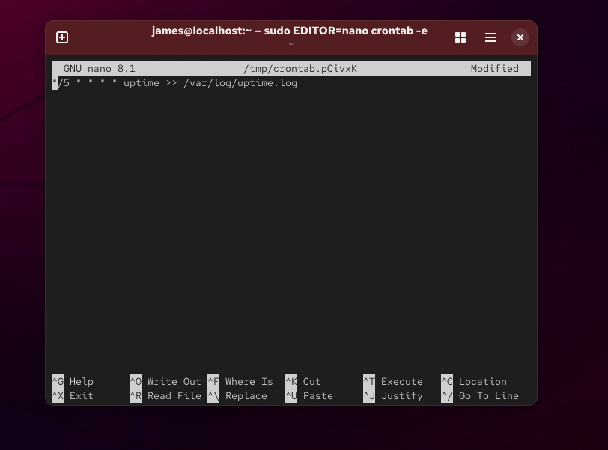
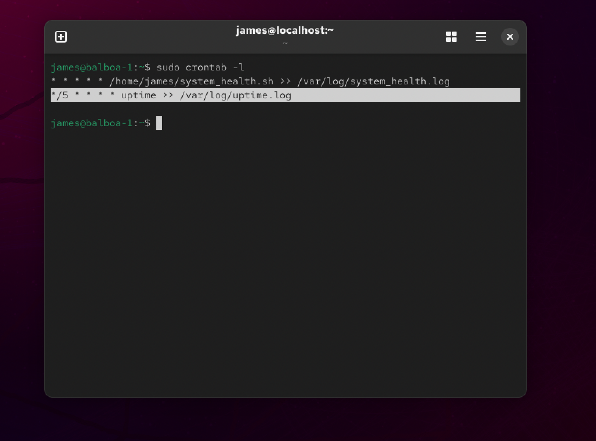
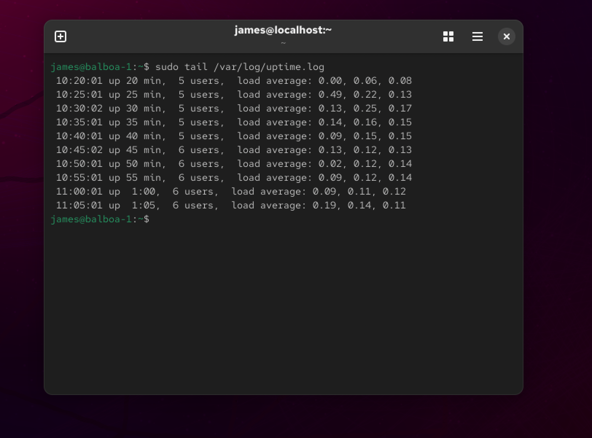
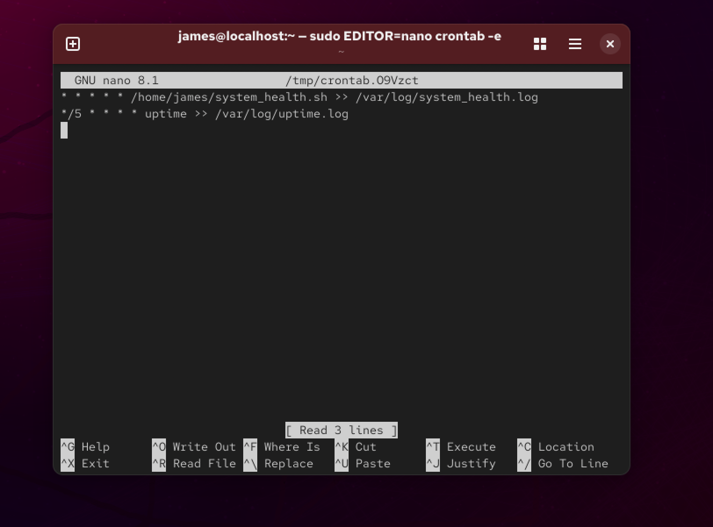
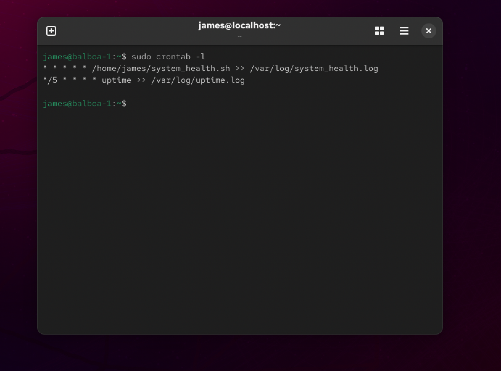

# Linux Virtual Machines

## Goals

-   Master core Linux commands
-   Build 2-node homelab in VirtualBox (Type 2 HyperVisor)
-   Automate system health checks with Bash

## Setup

1. Install VMWare Fusion
2. Download Rocky Linux 64-Bit ISO
3. Create two VMs in VMWare (to simulate different server nodes)
4. Allocate at least ~2 CPUs, 2GB RAM, and 20GB disk per VM.

## Configuring SSH

To SSH into a VM running on your host machine, you can use the following command (replacing user and ip with details from client VM):
`ssh user@192.168.x.x` or `ssh <hostname>` (by using steps below)
(Steps below are for MacOS)

1. Set static IP on each VM using `nmtui`
2. On host machine, edit `~/.ssh/config` to add the following lines for each VM (replacing values in <> with details from VMs):

```
Host <desired-hostname>
	HostName <ip-address>
	User <user-on-client>
```

3. On host machine, restart terminal then ssh into VM with following command `ssh <hostname>`

## Mini Project 1

Use `crontab -e` to schedule a command that appends system uptime to a log every 5 minutes

Add uptime command to cron with `sudo crontab -e`.


Ensure command added to crontab with `sudo crontab -l`.


Output from `/var/log/uptime.log`:


## Mini Project 2

Created `system_health.sh` to report uptime, memory, and disk usage every minute.

Create a file named `system_health.sh` with the following code:

```bash
#!/bin/bash
echo "System Report for $(hostname)"
echo "-----------------------------"
echo "Uptime:"; uptime
echo "Memory:"; free -h | head -2
echo "Disk Usage"; df -h | grep -v tmpfs
```

Edit crontab with `sudo crontab -e` and add the line `* * * * * /home/james/system_health.sh >> /var/log/system_health.log` (Replace `/home/james` with path to directory containing your script).


Ensure crontab edited successfully.


Output from `/var/log/system_health.log`:

